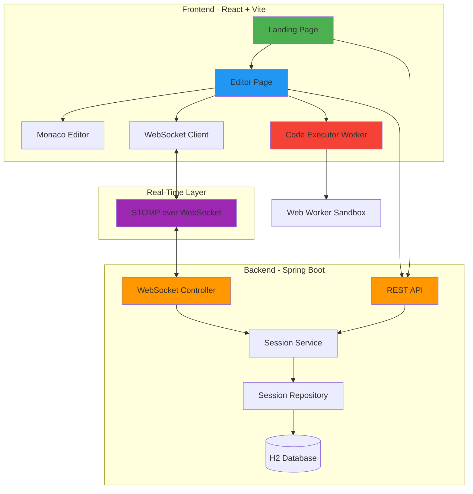
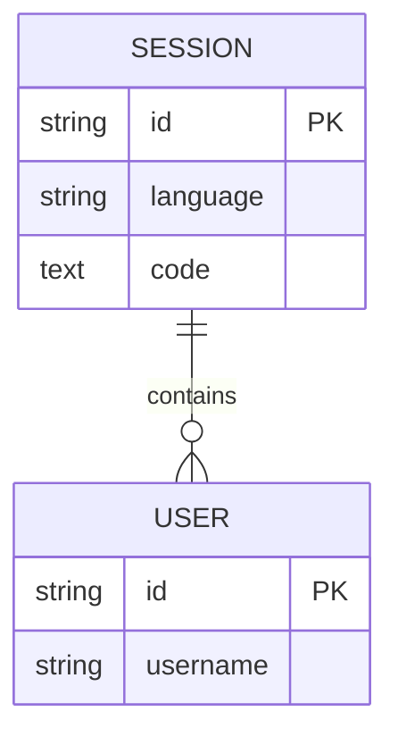
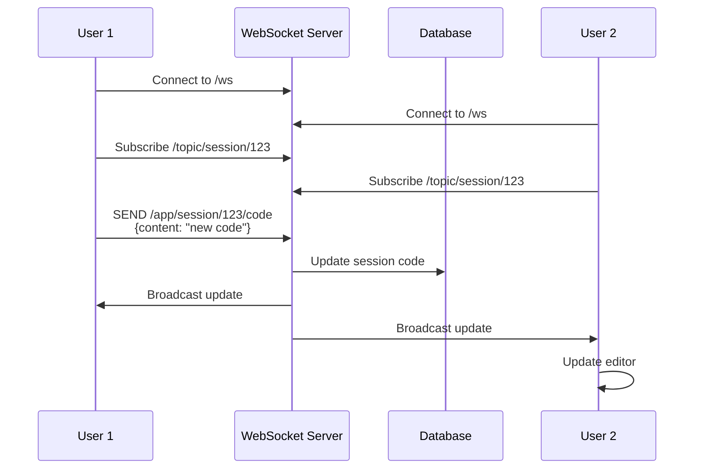
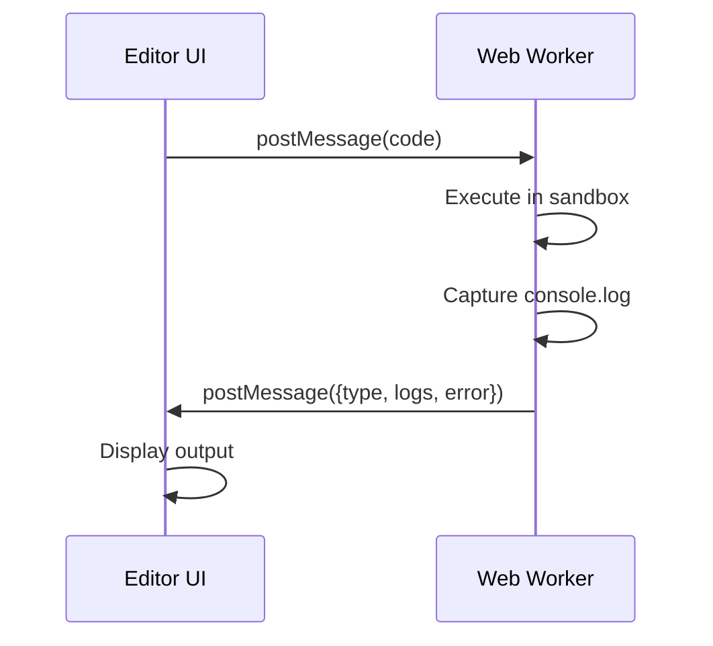

# Online Coding Interview Platform - Complete Architecture Guide

## Table of Contents
1. [High-Level Architecture](#high-level-architecture)
2. [Technology Stack](#technology-stack)
3. [Database Schema](#database-schema)
4. [API Design](#api-design)
5. [Real-Time Collaboration](#real-time-collaboration)
6. [Code Execution](#code-execution)
7. [Security Considerations](#security-considerations)
8. [Deployment Guide](#deployment-guide)
9. [Future Improvements](#future-improvements)

---

## High-Level Architecture



### Architecture Overview

The platform follows a **client-server architecture** with real-time bidirectional communication:

- **Frontend**: React SPA with Monaco Editor for code editing
- **Backend**: Spring Boot REST API + WebSocket server
- **Real-Time**: STOMP protocol over WebSocket with SockJS fallback
- **Execution**: Browser-side Web Workers for sandboxed JavaScript execution
- **Database**: H2 in-memory database (easily swappable to PostgreSQL)

---

## Technology Stack

### Backend
- **Framework**: Spring Boot 3.2.3
- **Java Version**: 21
- **Dependencies**:
  - `spring-boot-starter-web` - REST API
  - `spring-boot-starter-websocket` - WebSocket support
  - `spring-boot-starter-data-jpa` - ORM
  - `h2` - In-memory database
  - `lombok` - Boilerplate reduction

### Frontend
- **Framework**: React 19.2.0
- **Build Tool**: Vite 7.2.4
- **Language**: TypeScript
- **Key Libraries**:
  - `@monaco-editor/react` - Code editor
  - `@stomp/stompjs` - WebSocket client
  - `sockjs-client` - WebSocket fallback
  - `react-router-dom` - Routing
  - `tailwindcss` - Styling
  - `lucide-react` - Icons

---

## Database Schema

### Entity Relationship Diagram



### Tables

#### `session`
| Column | Type | Description |
|--------|------|-------------|
| `id` | VARCHAR(255) | Primary key, UUID |
| `language` | VARCHAR(50) | Programming language (e.g., "javascript") |
| `code` | TEXT | Current code content |

#### `app_user`
| Column | Type | Description |
|--------|------|-------------|
| `id` | VARCHAR(255) | Primary key, UUID |
| `username` | VARCHAR(100) | User's display name |

**Note**: `app_user` is used instead of `user` because `USER` is a reserved keyword in H2.

---

## API Design

### REST Endpoints

#### 1. Create Session
```http
POST /api/sessions
```

**Response:**
```json
{
  "id": "550e8400-e29b-41d4-a716-446655440000",
  "language": "javascript",
  "code": "// Start coding...",
  "users": []
}
```

#### 2. Get Session
```http
GET /api/sessions/{id}
```

**Path Parameters:**
- `id` (string) - Session UUID

**Response:**
```json
{
  "id": "550e8400-e29b-41d4-a716-446655440000",
  "language": "javascript",
  "code": "console.log('Hello World');",
  "users": [
    {
      "id": "user-uuid",
      "username": "interviewer"
    }
  ]
}
```

**Error Responses:**
- `404 Not Found` - Session does not exist

---

### WebSocket Protocol

#### Connection
```
Endpoint: ws://localhost:8080/ws
Protocol: STOMP over SockJS
```

#### Subscribe to Session Updates
```
SUBSCRIBE /topic/session/{sessionId}
```

#### Send Code Update
```
SEND /app/session/{sessionId}/code
Content-Type: application/json

{
  "content": "console.log('Updated code');"
}
```

#### Receive Code Update
```json
{
  "content": "console.log('Updated code');"
}
```

---

## Real-Time Collaboration

### Implementation Details

The platform uses **STOMP over WebSocket** for real-time collaboration:

1. **Connection**: Client connects to `/ws` endpoint using SockJS
2. **Subscription**: Client subscribes to `/topic/session/{sessionId}`
3. **Broadcasting**: When a user types, the update is sent to `/app/session/{sessionId}/code`
4. **Server Processing**: Spring's `@MessageMapping` receives the message, updates the database, and broadcasts to all subscribers
5. **Client Update**: All connected clients receive the update and sync their editor

### Flow Diagram



### Key Features
- **Multi-cursor support**: Ready for extension with cursor position tracking
- **Conflict-free updates**: Last-write-wins strategy (can be enhanced with OT/CRDT)
- **Automatic reconnection**: SockJS provides fallback mechanisms

---

## Code Execution

### Browser-Side Execution with Web Workers

For **security** and **performance**, code execution happens in a sandboxed Web Worker:

#### Worker Implementation (`executor.js`)
```javascript
self.onmessage = (e) => {
    const code = e.data;
    let logs = [];
    
    // Capture console.log
    console.log = (...args) => {
        logs.push(args.map(arg => String(arg)).join(' '));
    };

    try {
        new Function(code)();
        self.postMessage({ type: 'success', logs });
    } catch (error) {
        self.postMessage({ type: 'error', error: error.toString(), logs });
    }
};
```

#### Execution Flow


### Supported Languages
- **JavaScript**: Full support via Web Worker
- **Python**: Can be added using Pyodide (WebAssembly)
- **Other languages**: Require backend execution service (e.g., Piston API)

### Security Features
- ✅ Isolated execution context (Web Worker)
- ✅ No DOM access
- ✅ No network access from worker
- ✅ Timeout protection (can be added)
- ❌ Not suitable for untrusted code (use backend sandbox for production)

---

## Security Considerations

### 1. CORS Configuration
```java
@CrossOrigin(origins = "*") // ⚠️ Development only
```

**Production**: Restrict to specific origins
```java
@CrossOrigin(origins = "https://yourdomain.com")
```

### 2. WebSocket Authentication
**Current**: No authentication (open sessions)

**Recommended**:
- Add JWT-based authentication
- Validate session ownership
- Implement rate limiting

```java
@Configuration
public class WebSocketSecurityConfig {
    @Bean
    public SecurityFilterChain filterChain(HttpSecurity http) {
        http.authorizeHttpRequests(auth -> auth
            .requestMatchers("/ws/**").authenticated()
        );
        return http.build();
    }
}
```

### 3. Code Execution Sandbox
**Current**: Basic Web Worker isolation

**Production Recommendations**:
- Use backend execution with Docker containers
- Implement resource limits (CPU, memory, time)
- Use services like AWS Lambda or Judge0

### 4. Session Validation
- Validate session IDs to prevent enumeration
- Implement session expiration
- Add rate limiting on session creation

### 5. Input Validation
- Sanitize code content before storage
- Limit code size (e.g., 10MB max)
- Validate language parameter

---

## Deployment Guide

### Local Development

#### Prerequisites
- Java 21+
- Maven 3.9+
- Node.js 18+
- npm 9+

#### Backend Setup
```bash
cd backend
mvn clean install
mvn spring-boot:run
```

Backend runs on: `http://localhost:8080`

#### Frontend Setup
```bash
cd frontend
npm install
npm run dev
```

Frontend runs on: `http://localhost:5173`

---

### Production Deployment

#### Backend (Spring Boot)

**1. Build JAR**
```bash
cd backend
mvn clean package -DskipTests
```

**2. Run with Production Profile**
```bash
java -jar target/platform-0.0.1-SNAPSHOT.jar --spring.profiles.active=prod
```

**3. Environment Variables**
```bash
export SPRING_DATASOURCE_URL=jdbc:postgresql://localhost:5432/interview_db
export SPRING_DATASOURCE_USERNAME=dbuser
export SPRING_DATASOURCE_PASSWORD=dbpass
```

**4. Docker Deployment**
```dockerfile
FROM eclipse-temurin:21-jre
COPY target/platform-0.0.1-SNAPSHOT.jar app.jar
EXPOSE 8080
ENTRYPOINT ["java", "-jar", "/app.jar"]
```

```bash
docker build -t interview-backend .
docker run -p 8080:8080 interview-backend
```

---

#### Frontend (React)

**1. Build for Production**
```bash
cd frontend
npm run build
```

**2. Serve with Nginx**
```nginx
server {
    listen 80;
    server_name yourdomain.com;
    
    root /var/www/interview-platform/dist;
    index index.html;
    
    location / {
        try_files $uri $uri/ /index.html;
    }
    
    location /api {
        proxy_pass http://localhost:8080;
        proxy_http_version 1.1;
        proxy_set_header Upgrade $http_upgrade;
        proxy_set_header Connection 'upgrade';
        proxy_set_header Host $host;
        proxy_cache_bypass $http_upgrade;
    }
    
    location /ws {
        proxy_pass http://localhost:8080;
        proxy_http_version 1.1;
        proxy_set_header Upgrade $http_upgrade;
        proxy_set_header Connection "upgrade";
    }
}
```

**3. Docker Deployment**
```dockerfile
FROM nginx:alpine
COPY dist /usr/share/nginx/html
COPY nginx.conf /etc/nginx/conf.d/default.conf
EXPOSE 80
```

---

### Cloud Deployment Options

#### AWS
- **Backend**: Elastic Beanstalk or ECS
- **Frontend**: S3 + CloudFront
- **Database**: RDS PostgreSQL
- **WebSocket**: Application Load Balancer with sticky sessions

#### Google Cloud
- **Backend**: Cloud Run or GKE
- **Frontend**: Cloud Storage + Cloud CDN
- **Database**: Cloud SQL
- **WebSocket**: Cloud Load Balancing

#### Heroku (Quick Deploy)
```bash
# Backend
heroku create interview-backend
git subtree push --prefix backend heroku main

# Frontend
heroku create interview-frontend
heroku buildpacks:set heroku/nodejs
git subtree push --prefix frontend heroku main
```

---

## Future Improvements

### 1. Enhanced Collaboration
- [ ] Multi-cursor support with user colors
- [ ] Operational Transformation (OT) or CRDT for conflict resolution
- [ ] Chat functionality
- [ ] Video/audio integration

### 2. Advanced Code Execution
- [ ] Support for Python, Java, C++, Go
- [ ] Backend execution service with Docker
- [ ] Test case validation
- [ ] Performance metrics (time, memory)

### 3. Interview Features
- [ ] Question bank integration
- [ ] Timer functionality
- [ ] Code playback/history
- [ ] Interviewer notes
- [ ] Candidate evaluation forms

### 4. Security & Performance
- [ ] JWT authentication
- [ ] Session encryption
- [ ] Rate limiting
- [ ] CDN integration
- [ ] Code compression

### 5. Analytics
- [ ] Session analytics
- [ ] Code complexity metrics
- [ ] Time tracking
- [ ] Export to PDF

---

## File Structure

### Backend
```
backend/
├── src/main/java/com/codinginterview/platform/
│   ├── PlatformApplication.java
│   ├── config/
│   │   └── WebSocketConfig.java
│   ├── controller/
│   │   ├── SessionController.java
│   │   └── CollaborationController.java
│   ├── domain/
│   │   ├── Session.java
│   │   ├── User.java
│   │   └── CodeUpdateMessage.java
│   ├── repository/
│   │   └── SessionRepository.java
│   └── service/
│       └── SessionService.java
└── pom.xml
```

### Frontend
```
frontend/
├── src/
│   ├── components/
│   │   └── CodeEditor.tsx
│   ├── pages/
│   │   ├── LandingPage.tsx
│   │   └── EditorPage.tsx
│   ├── hooks/
│   │   └── useCollaboration.ts
│   ├── services/
│   │   └── api.ts
│   ├── workers/
│   │   └── executor.js
│   ├── App.tsx
│   ├── main.tsx
│   └── index.css
├── package.json
└── vite.config.ts
```

---

## Quick Start Commands

```bash
# Clone and setup
git clone <repo>
cd coding-interview

# Start backend
cd backend
mvn spring-boot:run

# Start frontend (new terminal)
cd frontend
npm install
npm run dev

# Open browser
open http://localhost:5173
```

---

## Support & Contact

For questions or issues, please refer to the project repository or contact the development team.

**Built with ❤️ using Spring Boot, React, and WebSockets**
